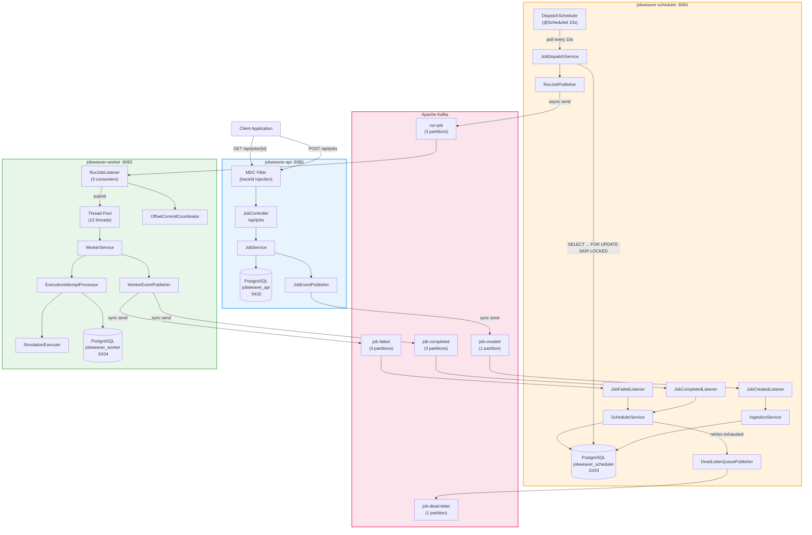
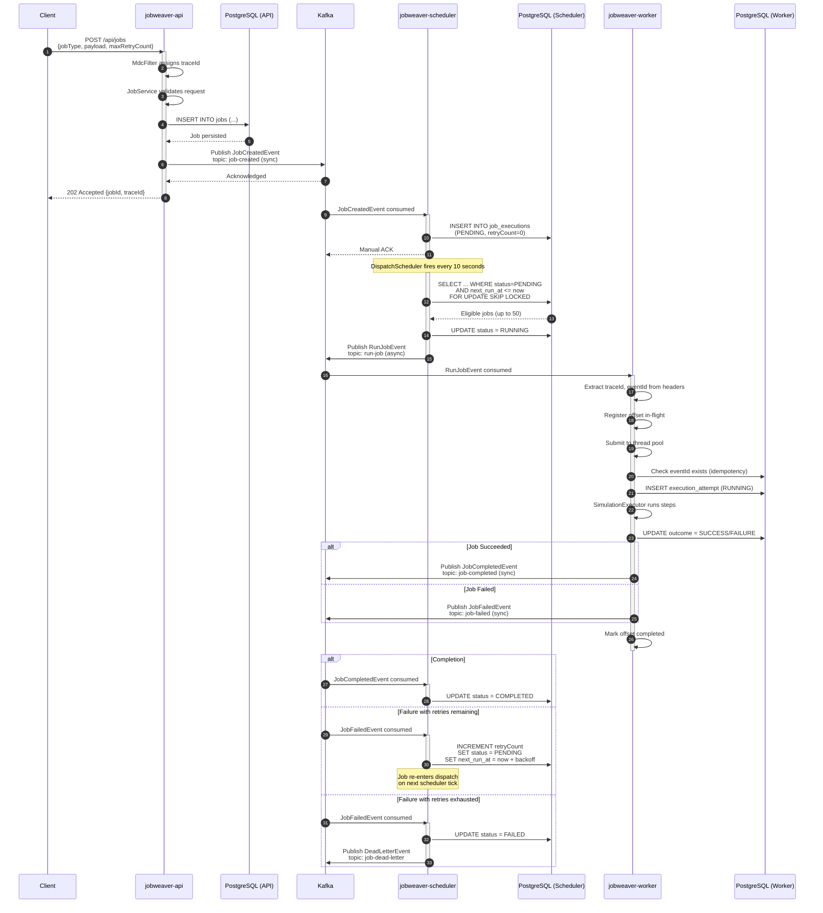
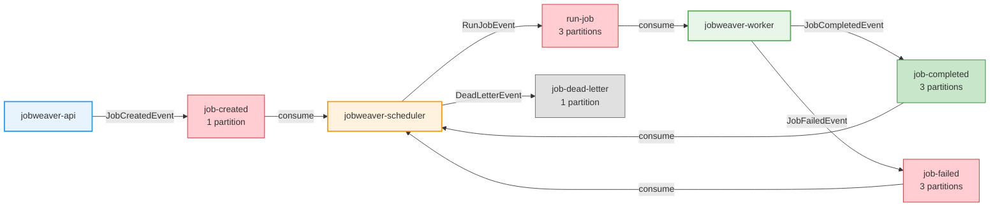
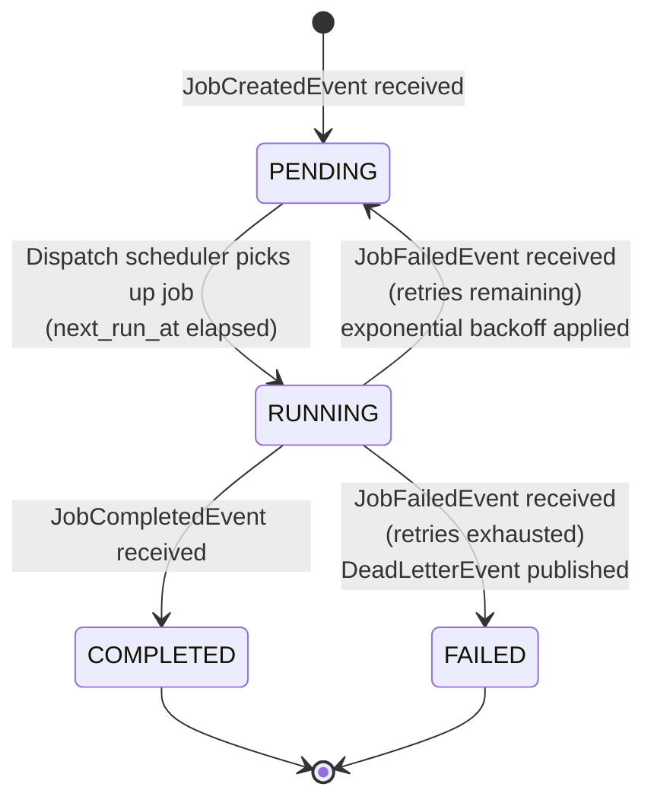
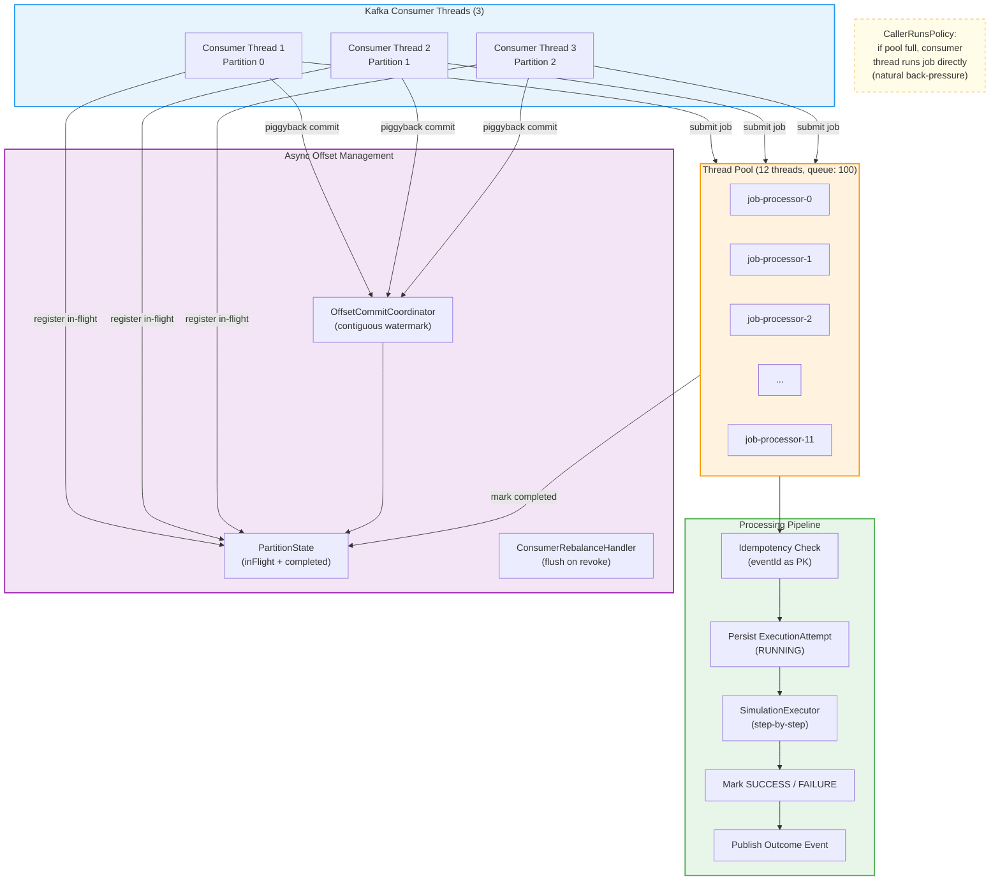
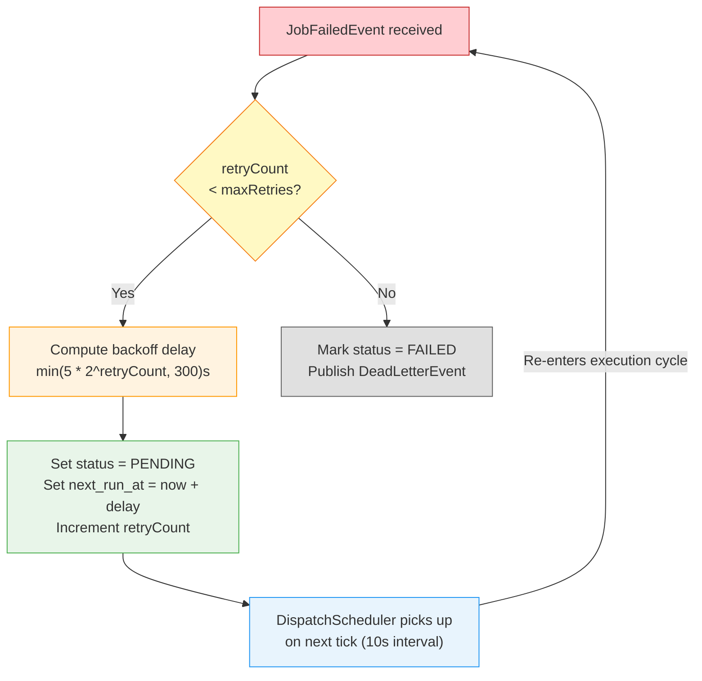
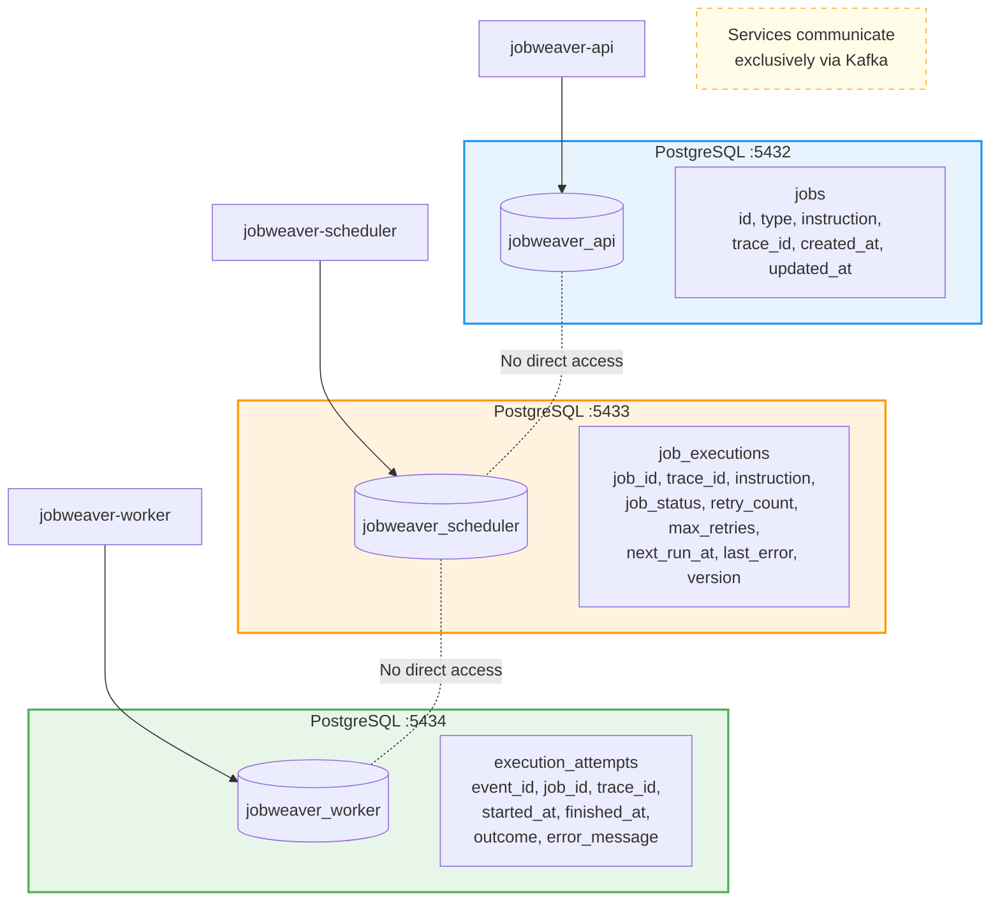
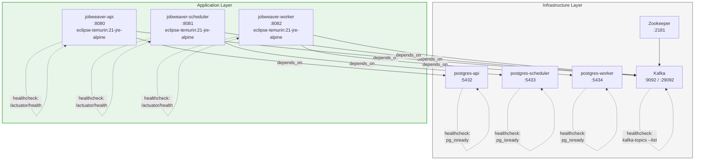

# JobWeaver -- Architecture Diagrams

> Mermaid-based diagrams illustrating the end-to-end request flow, service interactions, and internal component structures.

---

## 1. High-Level System Architecture

---

## 2. End-to-End Request Flow (Sequence)

---

## 3. Kafka Topic Flow

---

## 4. Job State Machine

---

## 5. Worker Thread Model

---

## 6. Retry and Backoff Flow

---

## 7. Database-per-Service Layout

---

## 8. Docker Compose Infrastructure

